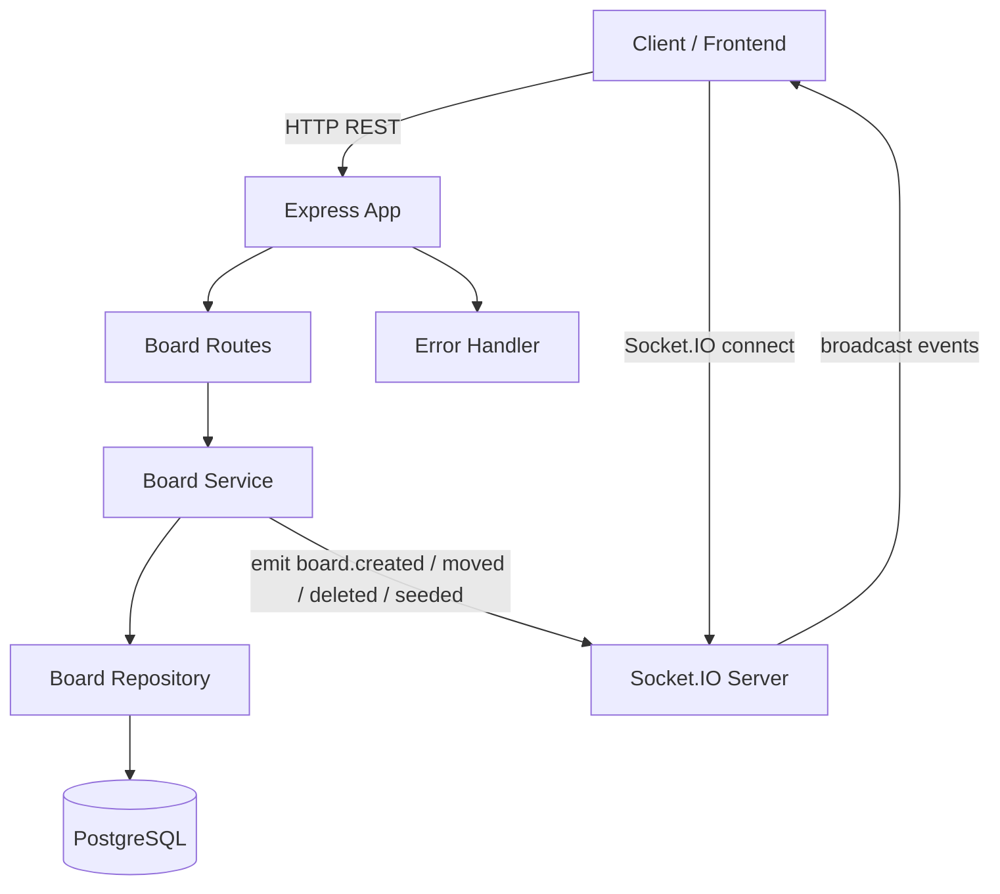
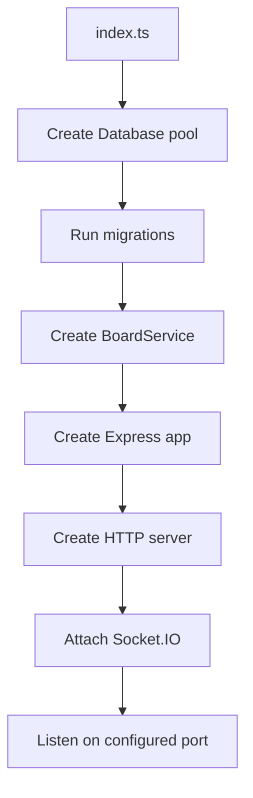
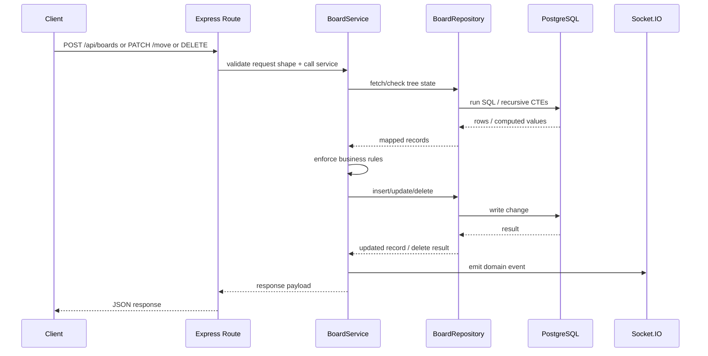
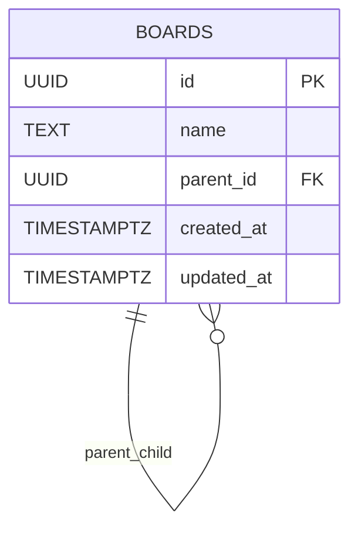
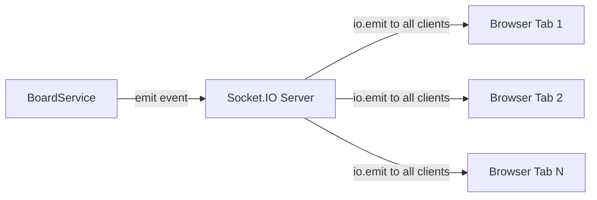

# Backend Architecture Sketch

## High-Level Flow

## Runtime Startup

## Request Path

## Layer Responsibilities

- `index.ts`
  - boots the app
  - creates DB connection pool
  - runs migrations
  - wires Express and Socket.IO together

- `app.ts`
  - creates the Express app
  - configures CORS and JSON parsing
  - mounts routes
  - mounts not-found and error handlers

- `routes/boards.ts`
  - validates request shape
  - parses nullable `parentId`
  - calls the service layer
  - returns JSON responses

- `services/boardService.ts`
  - owns business rules
  - validates board name
  - enforces max depth
  - prevents invalid moves and cycles
  - builds the tree response
  - emits board lifecycle events

- `repositories/boardRepository.ts`
  - contains DB queries
  - handles recursive CTEs for:
    - board depth
    - subtree height
    - descendant checks
    - subtree ID collection

- `db/*`
  - creates the pool
  - supports transactions
  - runs schema migrations

- `events/boardEvents.ts`
  - abstracts event publishing
  - lets the service emit events without depending directly on Socket.IO

## Current Data Model

## Important Backend Behaviors

- Create board
  - validates name
  - checks parent exists
  - checks `parent depth + 1 <= max depth`
  - inserts row
  - emits `board.created`

- Move board
  - checks source exists
  - checks destination exists
  - blocks move into self
  - blocks move into descendant
  - checks `destination depth + subtree height <= max depth`
  - updates `parent_id`
  - emits `board.moved`

- Delete board
  - collects subtree IDs
  - deletes root node
  - DB cascades descendants via `ON DELETE CASCADE`
  - emits `board.deleted`

- Seed boards
  - generates a template hierarchy
  - inserts the whole structure in a transaction
  - emits `boards.seeded`

## Current Realtime Model

- current implementation uses global broadcast
- there are no rooms yet
- there is no socket auth yet
- frontend reacts by invalidating and refetching the board tree

## Main Tradeoffs In Current Backend

- simple adjacency-list schema instead of more complex hierarchy models
- raw SQL instead of ORM for clarity around recursive logic
- service-layer validation instead of DB-trigger enforcement
- global socket broadcast instead of workspace-scoped rooms
- no explicit row locking for concurrent tree edits
- full-tree reads are simple now, but would need refinement at larger scale
